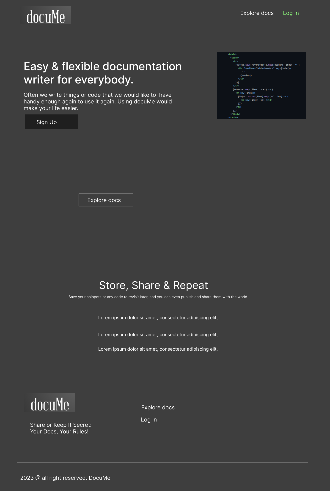
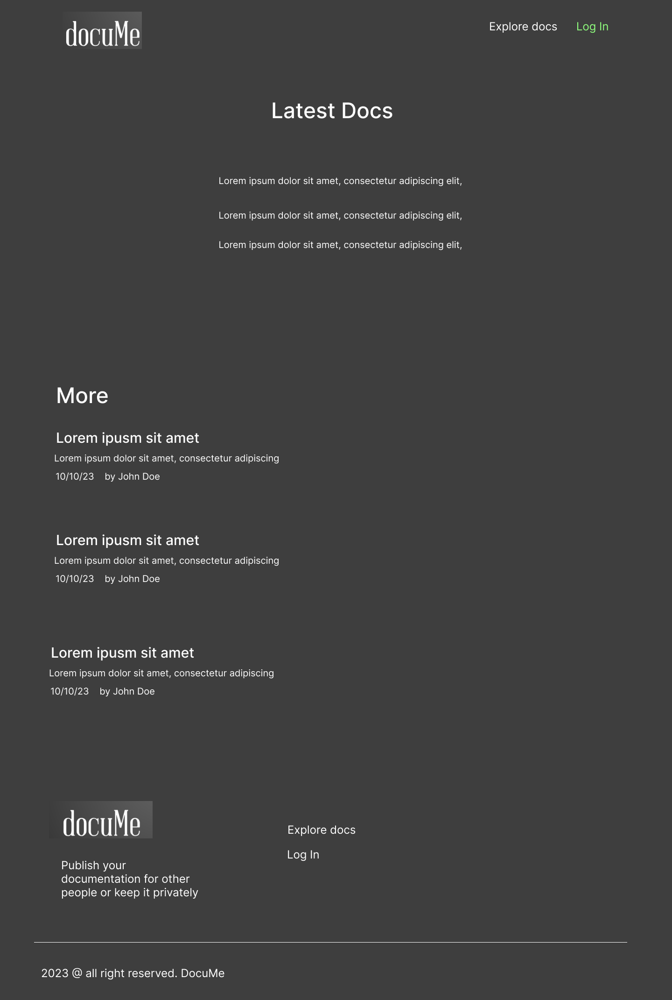
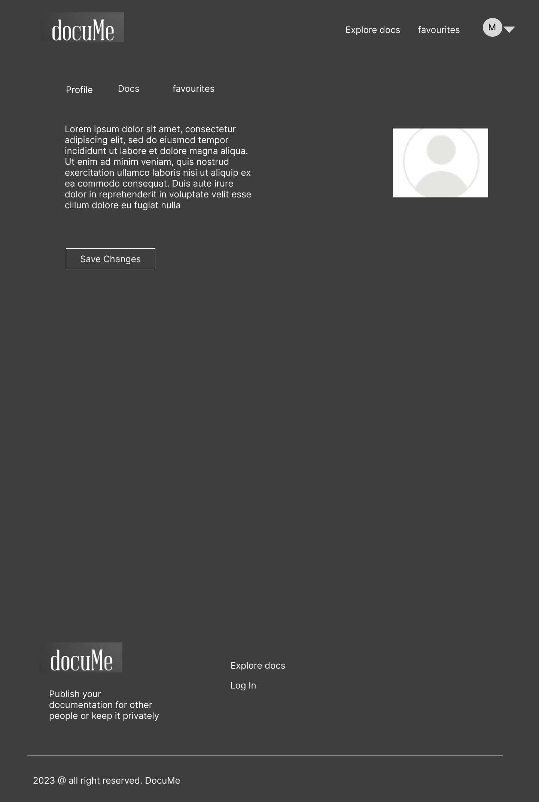
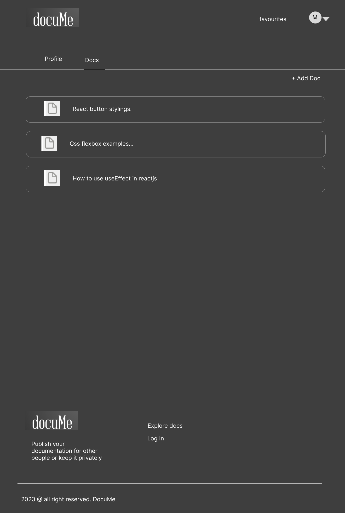
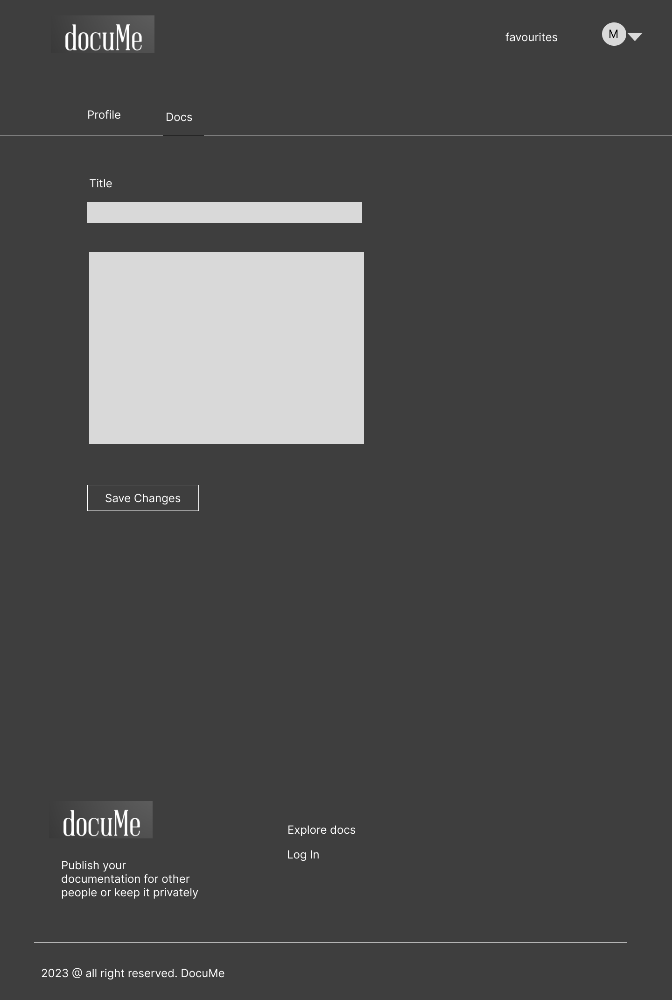

  
 
  
# DocuMe

  

## Overview

  

[DocuMe](https://docume-6885a52f1f5c.herokuapp.com/)   is a documentation/blog designed for users that would like to have  a convenient platform to store and manage their code snippets and or any documentation. 

## Table of Contents

  

- [User stories](#user-stories)

- [Wireframes](#wireframes)
  

- [Features Section](#features-section)
   - [Nabvar](#navbar)
   - [Home Banner](#home-banner)
   - [Call To Action](#call-to-action)
   - [Footer](#footer)
   - [Profile (Authenticated only) ](#profile-section)
   - [Docs (Authenticated only)](#docs-section)
   - [Favourites (Authenticated only)](#favourites-section)

  
  
- [Known Bugs](#known-bugs)
- [Database Schema](#database-schema)

- [Technologies](#technologies)

- [Other Tools](#other-tools)

  

- [Testing ](#testing)

- [Deployment](#deployment)

- [Credits](#credits)

  
  

## Wireframes 

### User stories

  
[USER STORY: Account Registration#1](https://github.com/saamauro92/docume/issues/1)

As a **Site user** I can **register an account** so that **I can create documents and save documents to favourites**

[USER STORY: Create Documentation#2](https://github.com/saamauro92/docume/issues/2)

As a **Site User** I can **create documents** so that **I can save them and see them**
  
[USER STORY: Manage docs#3](https://github.com/saamauro92/docume/issues/3)

As a **Site admin** I can **create, read, update and delete documentation ** so that **I can manage my content**

[USER STORY: View public documents#4](https://github.com/saamauro92/docume/issues/4)
  
As a **Site User** I can **view a list of public documents** so that **I can select one to read**

[USER STORY: Open a doc#5](https://github.com/saamauro92/docume/issues/5)

As a **Site User** I can **click on a public doc** so that **I can read the full document**

[USER STORY: Comment on docs#6](https://github.com/saamauro92/docume/issues/6)

As a **Site User** I can **leave comments on a doc** so that **I can be involved in the conversation or leave a feedback**

[USER STORY: View comments#7](https://github.com/saamauro92/docume/issues/7)

As a **Site User** I can **view comment on an individual doc ** so that **I can read conversation or feedbacks**

[USER STORY: Add to favourites#8](https://github.com/saamauro92/docume/issues/8)

As a **Site User** I can **add to favourite individual public docs** so that **read them or save them for later**

[USER STORY: Add image to profile#9](https://github.com/saamauro92/docume/issues/9)

As a **user** I can **add a new profile image to my account** so that **be identified with the picture**

[USER STORY: Delete post from profile view#10](https://github.com/saamauro92/docume/issues/10)

As a **User** I can **Delete documents from my profile** so that **manage which ones I want or not**

[USER STORY: Update profile information#11](https://github.com/saamauro92/docume/issues/11)

As a **User** I can **update personal information** so that **manage my account information**

[USER STORY: CRUD documentation#12](https://github.com/saamauro92/docume/issues/12)

As a Site User I can **create, read, update and delete documentation ** so that I can manage my content

## Features
 
#####  Navbar
  
- This feature will display the website logo as a link and also contain two list menus. One is for unauthenticated users, allowing them to explore posts, sign in, or register. The other is for authenticated users, allowing them to explore posts and navigate to their profile, docs, favorites, and to log out. 

 

#####  Home Banner
  
- This section will display a header description and image, along with 'Explore' and 'Log In' buttons. The 'Log In' button will disappear if the user is authenticated . 

 
  

#####   Call To Action
  
- This section will display a description and a call to action button to sign up or to create a doc post for authenticated users . 

 

#####   Footer
  
- This section will display the website logo as a link, a subheader, and also contain two list menus. One is for unauthenticated users, allowing them to explore posts, sign in, or register. The other is for authenticated users, allowing them to explore posts and navigate to their profiles, docs, favorites, and to log out. Additionally, it will display the 'all rights reserved' notice for the website

 

#####   Profile Section  
  (Authenticated users only)
- This section will display the user's profile information and a placeholder image if no image was added. Additionally, it will include a button for updating the profile.

 

#####   Docs Section 
  (Authenticated users only)
- This section will display the user's own doc posts on their profile, allowing access to view, update, or delete them

 
 
#####   Favourites Section 
  (Authenticated users only)
- This section will display the user's favourites doc posts, allowing access to view and delete them.

 

#### Features Left to Implement

- I would like users to be able to log in with GitHub and Facebook.
- I would like users to be able to change the code editor in the forms.
- I would like users to be able to change the code editor in the forms.

- I would like to add a live likes counter.

 ## Known Bugs
 - Mobile version: When click on profile links they will not display

## Database Schema

[Download Full Quality Version](https://asset.cloudinary.com/dtycp96d8/e47629d4dd8e3e40dfb517b67aa50c04)
 
  

## Technologies
  
- Python

The Python framework [Django](https://www.djangoproject.com/) was used to create this project, following the Model-View-Template design pattern.

- Elephantsql

The relational database used in this application.

- HTML5

Markup language used across the app.

- CSS3

- SASS

CSS preprocessor.

- JavaScript

 

### Other Tools

  
- GitHub

Used to store this project's source code.

- Heroku

Used to host this app.

- Visual Studio Code

IDE.

- Figma

Designs

## Testing

### Manual testing
 

  
| Feature | Expect | Action | Result | Pass/Fail |
|--|--|--|--|--|
| Navbar| When selecting each link will redirect to the correct page | selected explore docs , profile, docs, favourite and signin/signup | redirect correctly |:heavy_check_mark:|
| Home  Banner | When click on links they will redirect appropiately | Clicked in explore docs and sign up links/buttons  | When clicked, the links will redirect appropriately |:heavy_check_mark:|
| Add Recipe by name input| When typing and entering any string will start preparing the recipe | typed a string  | action perfectly executed |:heavy_check_mark:|
| Call to action banner | Click on the link will redirect appropiately | clicked on available link   | link redirected appropiately |:heavy_check_mark:|
| Add Recipe by ingredient input| When typing and entering any string will display the secondary menu | typed a string  | secondary menu displayed |:heavy_check_mark:|
| Footer| When selecting each link will redirect to the correct page| selected explore docs , profile, docs, favourite and signin/signup | redirect correctly |:heavy_check_mark:|
| Profile Page | when select on update profile will redirect to the form page | selected update profile button  | redirect correctly to update profile page |:heavy_check_mark:|
| Update Profile Form | After completing the form, clicking the 'Update Profile' button should update the user's information | completed form and click on update profile  | successfully updated |:heavy_check_mark:|
| Docs Page| When any link is selected, it will redirect appropriately. Additionally, if you select to delete a doc post a confirmation popup will appear.  | selected each link , and selected delete post  | all the actions are working perfectly |:heavy_check_mark:|
| Create Post Form | After completing the form, clicking the 'Create Post' button should create a new docpost | completed form and click on create post  | successfully created |:heavy_check_mark:|
| Update Post Form | After completing the form, clicking the 'Update Post' button should update the docpost | completed form and click on update post  | successfully updated |:heavy_check_mark:|
| Favourite Page| When click in the delete post button a confirmation popup will appear  | clicked in delete post  | popup appeared and click 'ok' to confirm will delete post |:heavy_check_mark:|

## Create Database 

 1)  **Log in** to [ElephantSQL.com](https://www.elephantsql.com/) to access your dashboard
2)  Click “**Create New Instance**”
3)  Set up your plan
4)  Select “**Select Region**”
5) Select a data center near you
6) Then click “**Review**”
7) Check your details are correct and then click “**Create instance**”
8) Return to the ElephantSQL dashboard and click on the  **database instance name**  for this project
9) In the URL section, click the copy icon to copy the database URL to then paste in your ENV file
## Deployment

### How to deploy to Heroku

Log into Heroku 

1.  Click “**New**”
    
2.  Click “**Create new app**”
    
3.  Give your app a name and select the region closest to you. When you’re done, click “**Create app**” to confirm.

  ### Heroku Config Vars
1.  Go back to the Heroku dashboard open the  **Settings**  tab
    
2.  Add three config vars:
    
    -   `DATABASE_URL`, and for the value, copy in your database URL from ElephantSQL, no need to add quotation marks.
        
    -   `SECRET_KEY`  containing your secret key.
        
    -   `PORT`  and the value 8000
    

    
  

## Credits

  - Code institute student program
  - Alan Bushell my cohort facilitator for support and advice.

### Tutorials/Documentation

[Djangoproject.com](https://www.djangoproject.com/)
[Sass and Media Queries - DEV Community](https://dev.to/paul_duvall/sass-and-media-queries-hb2)
[How To Authenticate Django Apps using django-allauth | DigitalOcean](https://www.digitalocean.com/community/tutorials/how-to-authenticate-django-apps-using-django-allauth)
[python - Django link to a specific users profile page - Stack Overflow](https://stackoverflow.com/questions/72931638/django-link-to-a-specific-users-profile-page)
[User authentication in Django | Django documentation | Django](https://docs.djangoproject.com/en/dev/topics/auth/#storing-additional-information-about-users)
[python - get user profile in django - Stack Overflow](https://stackoverflow.com/questions/13460426/get-user-profile-in-django)
[AllAuth](https://docs.allauth.org/en/latest/)
[Using the Django authentication system | Django documentation | Django](https://docs.djangoproject.com/en/4.2/topics/auth/default/)
[Dynamic Page Titles in Django](https://iheanyi.com/journal/2020/04/04/dynamic-page-titles-in-django/)
[User Registration in Django using Google OAuth | Engineering Education (EngEd) Program | Section](https://www.section.io/engineering-education/django-google-oauth/)
[LOGOUT DEF](https://stackoverflow.com/questions/18875002/django-csrf-verification-failed-while-logout)
[How To Create Tabs](https://www.w3schools.com/howto/howto_js_tabs.asp)
[A Django Blog In VS Code — Upload Profile Picture | by J3 | Jungletronics | Medium](https://medium.com/jungletronics/a-django-blog-in-vs-code-6dee94cec9c0)
[(228) Upload Profile Pic Form - Django Wednesdays Twitter #13 - YouTube](https://www.youtube.com/watch?v=_P_-gum7rio)
[(228) Image File Upload to User Profile Model | Django (3.0) Crash Course Tutorials (pt 17) - YouTube](https://www.youtube.com/watch?v=aNk2CAkHvlE)
[Forms have never been this crispy — django-crispy-forms 2.0 documentation](https://django-crispy-forms.readthedocs.io/en/latest/)
[The web framework for perfectionists with deadlines | Django](https://www.djangoproject.com/)
[python - How can I set a DateField format in django from the model? - Stack Overflow](https://stackoverflow.com/questions/30911612/how-can-i-set-a-datefield-format-in-django-from-the-model)
[datetime - DateField in Django Forms shows like simple text input - Stack Overflow](https://stackoverflow.com/questions/68693455/datefield-in-django-forms-shows-like-simple-text-input)
[python - How to auto generate slug from my Album model in django 2.0.4 - Stack Overflow](https://stackoverflow.com/questions/50436658/how-to-auto-generate-slug-from-my-album-model-in-django-2-0-4)
[CSS Dropdowns](https://www.w3schools.com/css/css_dropdowns.asp)
[Fly-out Menus | Web Accessibility Initiative (WAI) | W3C](https://www.w3.org/WAI/tutorials/menus/flyout/)
[Custom code editor in Django admin](https://mrcoffee.io/blog/code-editor-django-admin)
[css - JavaScript display none after CSS3 animation - Stack Overflow](https://stackoverflow.com/questions/18601648/javascript-display-none-after-css3-animation)
[How to compile ASS/SCSS files when deploying a Django app to Heroku](https://vitorbaptista.com/how-to-compile-sass-scss-files-when-deploying-django-to-heroku?fbclid=IwAR2Up6cXvXhoLYFAVhmtr0AX-ezk1DHK9BEykJSuhUD5XwTEFMgUHAECYoc)
[Compile SASS/SCSS files on Heroku in Django app - Stack Overflow](https://stackoverflow.com/questions/55763732/compile-sass-scss-files-on-heroku-in-django-app)
[drpancake/heroku-buildpack-django-sass - Buildpacks - Heroku Elements](https://elements.heroku.com/buildpacks/drpancake/heroku-buildpack-django-sass)
[django - The directory '/static/' in the STATICFILES_DIRS setting does not exist. (Visual Studio) - Stack Overflow](https://stackoverflow.com/questions/71278346/the-directory-static-in-the-staticfiles-dirs-setting-does-not-exist-visual)
[Dynamic page titles in Django - Forge](https://www.forgepackages.com/guides/page-titles/)
